# [Monolith Gantry](https://github.com/CloakedWayne/Monolith_Gantry_V2-VT)

This might be one of the coolest mod I have seen. I have always wanted to do an AWD mod. Who needs a I4 when you can have a V8? However, early AWD mods for Voron 2.4 block off part of a build plate. This makes defining printable area tricky, and I don't trust myself with remembering where i can and can't use. I'm sure there are ways around it from the original creaters and the community, but these issues, together with the lack of a better understanding stopped me before I get to learn more. 

Then there's the Monolith. It's configurable, does not block the print bed, and a vibrant community. The BOM configurator is easy to use (you need to run it in google sheets. Customization is borked if you download it), but there is no installation manual. One can always use the included .step file to have a finished view, and make out steps to do, but this can be compiled better. I will document each step in my build (**printed everything, flying gantry, AWD, 6mm belts, 2 short shafted motors, no sensorless homing, allow front&rear protrusion**) as much as i can [for those who come after](https://www.youtube.com/watch?v=p00EF6_b5pI&list=RDp00EF6_b5pI&start_radio=1). 

## Protrusions
If you allow pertrusion at front, the motor mount and motors get pushed out by 6mms. Similarly, allowing pertrusion at the back pushes the entire assembly at the back (two motor mounts and motors, and x-axis beam) out by 6mm. 
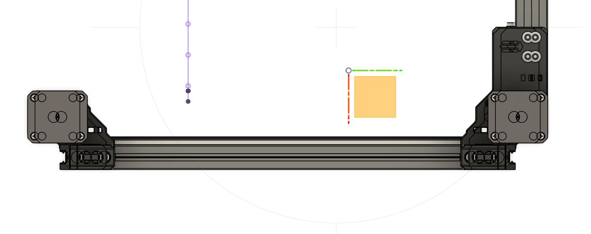

Cleverly, this is done via 4 spacer that attaches to the Z-axis linear rails and pushes the z-joint (and thus each corner of the gantry) together. If you print our "Printed_Hybrid_V2_Z_joint_spacer_NP" and wonder what is the thing in the middle (in itself, it's the "V2_spacer_FT"), well, it is what let you convert into a protruded build. Remove this spacer and put V2_spacer_FT in your rear motor mount as the new stopper for your extrusion, and you get some extra space. 
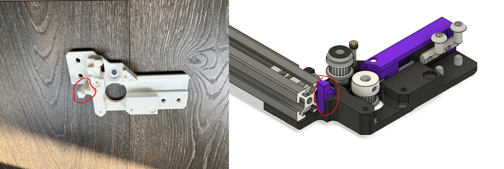

### What about my panels?
The original mounting method of your panels wont work with protrusions unless they are sitting at least 6mm away from the extrusions. This is exactly what [Monolith Panels](https://github.com/CloakedWayne/Monolith_Panels) do.  They push out the panels by 6mm on each side, uses a clip that grabs onto your extrusion for simplified mounting and removal, and adds some "flare". 

## Plan:
I like to change one thing at a time to better evaluate and trouble shoot my projects, but there's a lot in changing a gantry. We need to consider compatibility in toolhead and z-homing methods, so I looked into this. As it turns out, the belt spacing on a Monolith gantry is identical to that in a standard voron gantry, aside from the fact that the belts are moved outward by ~0.8mm. 
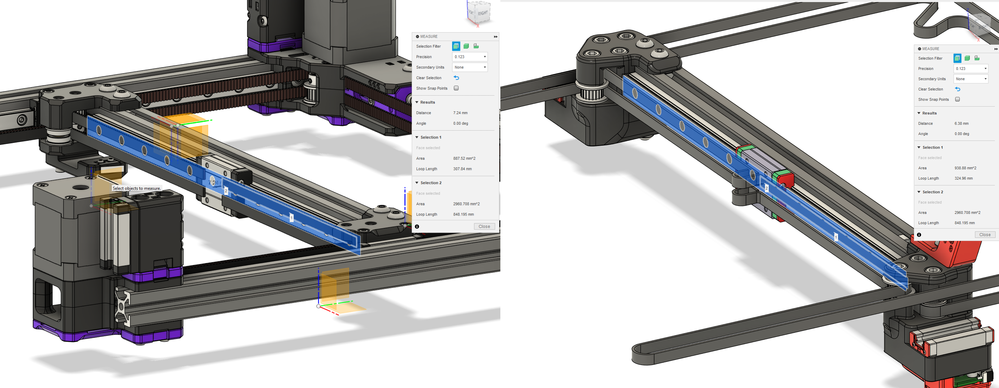

This means that whatever z-homing method/carrige you used with a standard voron build most likely works fine here. The other concern is toolhead. It needs to physically fit in the new constraints set by the front motors, and the constraints are tight to say the least (red rectangle is gained via allowing protrusion). 
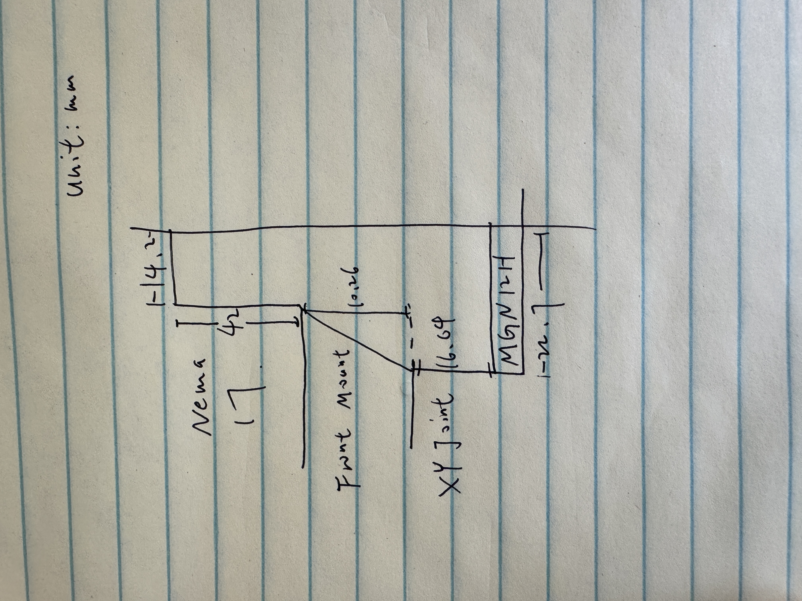

Luckily, there are three redeeming qualities. 
1. The space is tight, but large enough. The only necesseties to put in the constrainted space are hotend, hotend fans, and extruder. The extruder can be positioned close enough to the rail to dodge the Nema 17 motors, and the hotend takes even less space. Thus, a toolhead that wastes no space is totally possible.
2. Unless you are working with 4 short shafted motors, all motors will be on top of the gantry. This means you can put as much things as possible under the X-axis. Certain toolhead designs (like the [Gustav Railway Toolhead](https://github.com/RCI-Nicket/Gustav-Railway-Toolhead)) leverages this and puts the part cooling fan under. 
3. I found about 10mm of Y-overtravel in my machine. This means you can fit a CPAP chute down behind the X-axis. 
Overall, a monolith toolhead that preserves all build volume is indeed possible, and there are ongoing progresses to tackle them.

I also need to look into VZbot's toolheads, and how they handle their z-offest and bed mesh generation.

## Comparisons to other AWD projects
The other two AWD projects I looked into are [Mammoth](https://github.com/mammoth-3D/Mammoth-FDM-MODs) and the OG AWD setup by [aTinyShellScript](https://github.com/aTinyShellScript/v2.4_AWD). The mammoth has an interesting design
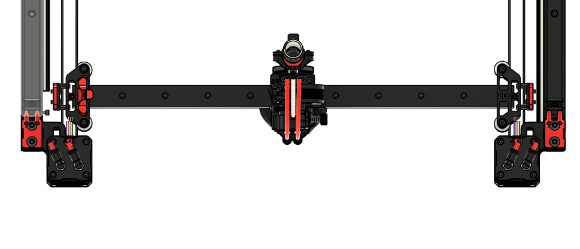 that seem to draw more insporation from [VZbot](https://github.com/VzBoT3D/VzBoT-Vz330). It looks extra spacious, and seems to not have any physical constaint from the front motors at all in the same frame of a voron 2.4. This drew my attention: if the z axis beams are at the same position and the Nema 17 motors are a fixed size, there is no reason why it wont block off build volumes for Mammoth while it does for Voron, assuming the same build volume. As it turns out, there's no magic, but subtle differences. 

| Part | mammoth | Voron (and monolith) |
| -------- | ------- |
| X rail | 380mm | 400mm |
| X beam | 414mm | 430mm |
| slider | MGN9H | MGN12H |
| slider width | 39.9mm | 45.3mm |
| Max Effective X travel | 340.1 | 354.7 |

Tinkering with the CAD, I found that the max travel of a mammoth is around 336mm on the X-axis. 
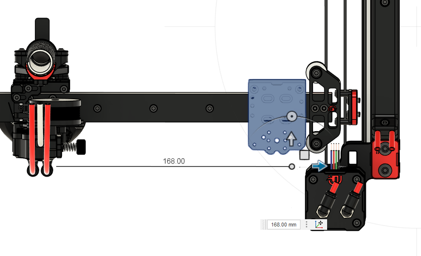

What do you know, the VZbot has a 330mm build. I guess this makes sense. 

Keeping in mind that the nema 17 motors on a monolith blocks off 8.5mm on each side. If we cut those parts out, we get 333mm of travel. Close enough. 

The second contender is [aTinyShellScript's AWD setup](https://github.com/aTinyShellScript/v2.4_AWD) whose CAD files do not include a X-axis for me to tinker with. Luckily, there are other ways we can look into this. First of all, there is no reason to assume any difference on the back side. They all adapt from a stoick voron build with the 10mm overtravel without taking much extra space. On the front side, the Nema 17 motors are further away from the front of the Y-beam, blocking more space in the X and Y axis.
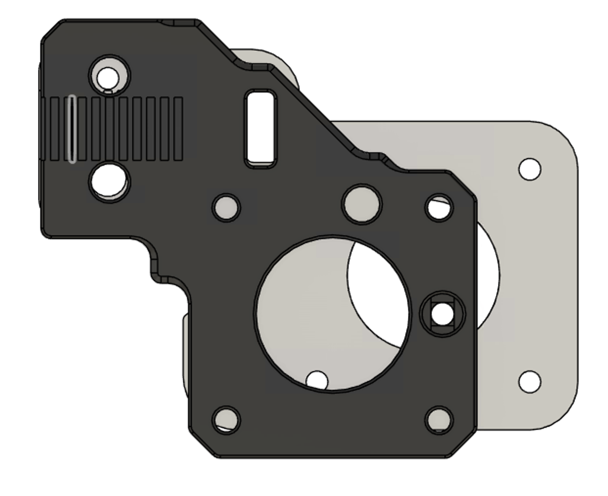

Given that preserving build volume is more important to me than optimization for speed, it is clear that monolith is the way to go.

## Other things to print
You might want to print the [Voron pulley jig](https://github.com/VoronDesign/Voron-2/blob/Voron2.4/STLs/Tools/pulley_jig.stl) and the [Voron hub puller](https://github.com/VoronDesign/Voron-2/tree/Voron2.2/STLs/VORON2.2/Tools). You want to print the Voron hub puller stronger, as dehubbing a pulley requires significant force. 

## My Installation Manual
I will assume that you are familiar with the build process of a Voron 2.4. If not, you can reference the [Voron manual](https://github.com/VoronDesign/Voron-2/raw/Voron2.4/Manual/Assembly_Manual_2.4r2.pdf).

0. Aside from everything in the BOM, if you come from a standard 2 motor Core-XY build, you need 2 extra motors and 2 stepper drivers. 
1. I printed all my parts with ABS under standard [voron printed parts settings](https://docs.vorondesign.com/sourcing.html).
2. Install Heat Set Inserts: The BOM calls for 8 M3xD5x4 threaded inserts. There are 2 in each XY_joint_b, 1 in each tensioner_b, and 1 in each rear_motor_mount_a.
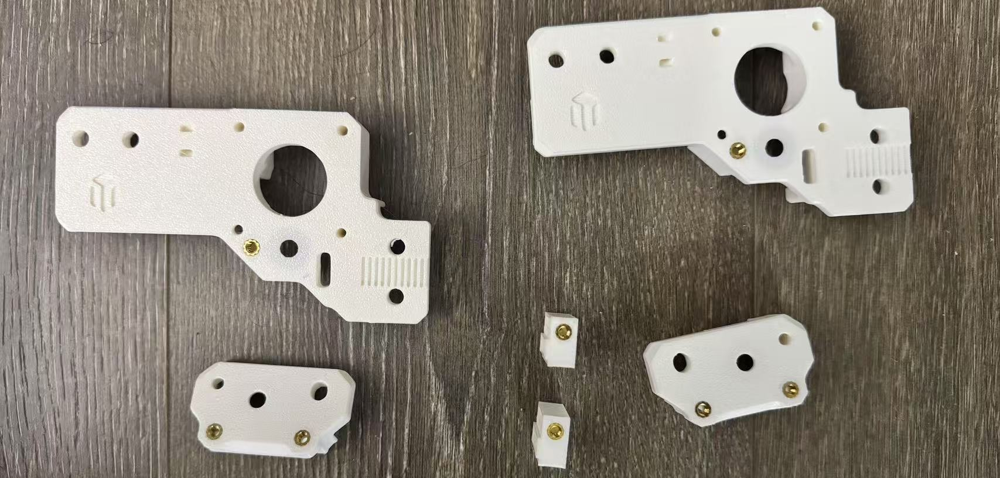
3. Front side (x2)
    1. Insert two pins in the following fashion. They are tight. I used a vise to push it in. The pin is supposed to fix to the body and does not rotate (dead shaft). 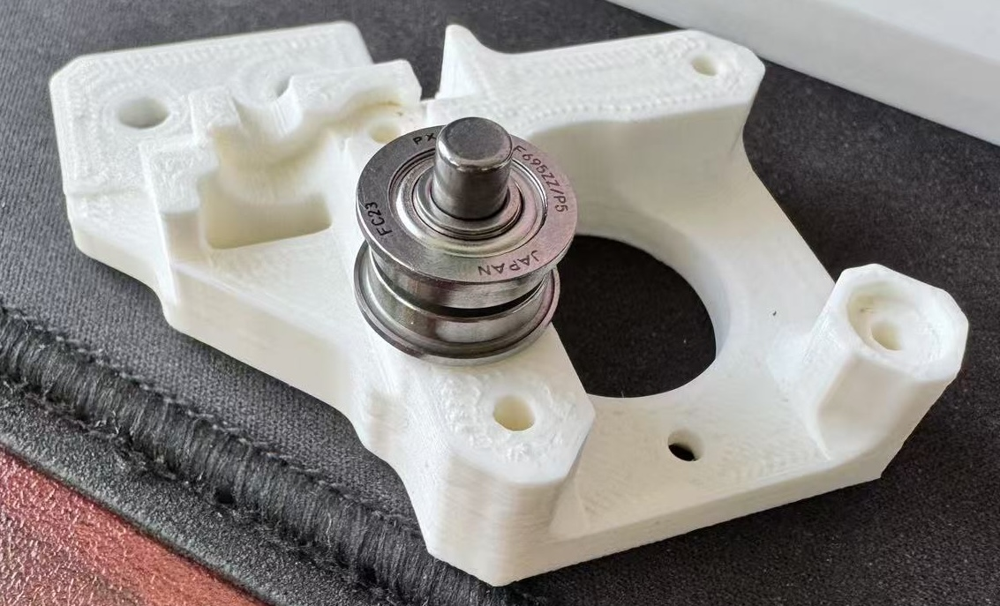
    2. Make 2 bearing kababs with the following layers: 0.5mm M5 shim, F695 bearing, 1mm M5 shim, F695 bearing, 0.5mm M5 shim. The flange on the F695 bearing should be near the 0.5mm shim. 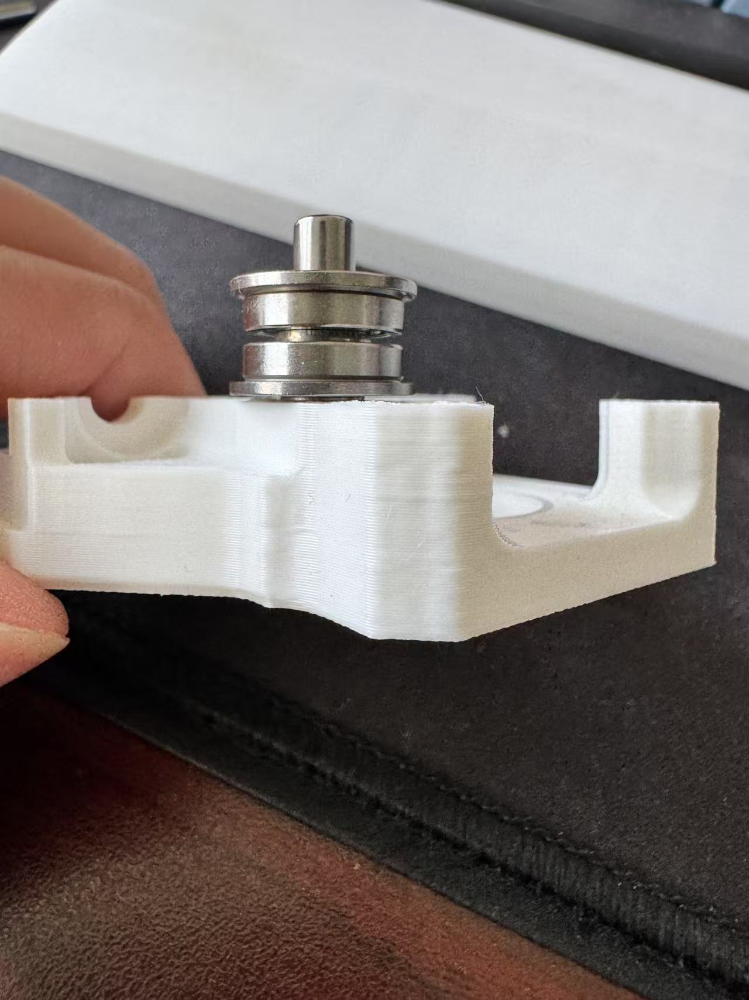 
    3. Install pulleys onto the motor shaft. The spacing between the motor and the pulley and the orientation of the pulley are identical to that of a Voron 2.4 gantry. You can use the [Voron pulley jig](https://github.com/VoronDesign/Voron-2/blob/Voron2.4/STLs/Tools/pulley_jig.stl) to help with the spacing and verify with the CAD for the orientation of the pulley. A rule of thumb is that the pulley's teeth should be on the same height as the bearing kabab you just made. I did not follow the specs to use one long + one short shafted motor. Instead, I used 2 short shafted motor for the front. This is because the long shafted motors I got [LDO 42STH48-2804AH](https://west3d.com/products/ldo-motors-42sth48-2804ah-super-speedy-super-power-high-temp-nema-17-stepper-motor-high-performance-high-temperature) has cable fixed to the motor, and the attached cable is not long enough for routing from the front. Since the biblical voron 2.4 uses the same motor-pulley setup, I think this is good enough, even though BOM calls for at least a 35mm shaft. 
    4. Install the motor. Make sure that the motors are on TOP of the gantry. This is likely because motor under the gantry crushes into your print bed. I will verify this at a later time. 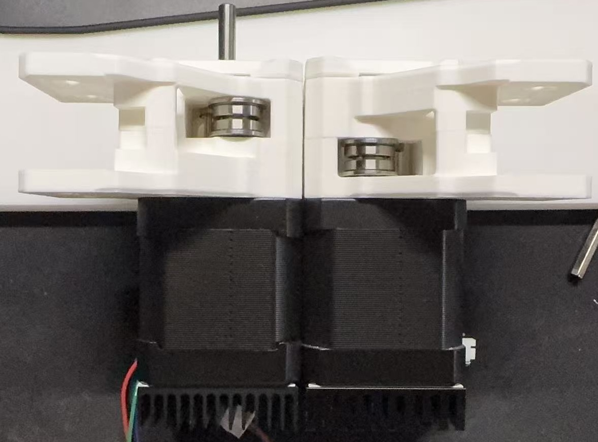  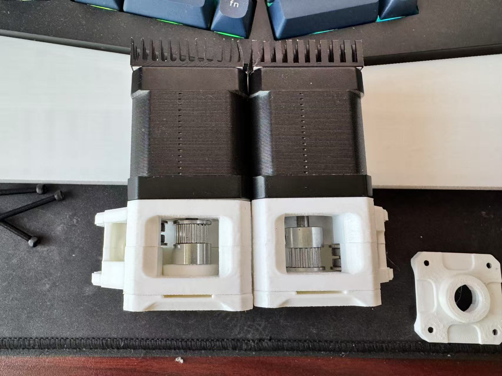 
4. Back side (x2) 
    0. Make 4 de-hubbed pulley
        1. The part of the pulley with screw-holes are called the "hub", and the other (thin) side is called a flange. To dehub a pulley, remove the hub, then remove the flange from another pulley. Lastly, put the removed flange on to the de-hubbed core so both side has a flange of the same width. 
    1. Tensioners(x2)
        1. prepare two tensioners: each tensioner-b has two holes. Put a M3x10 SHCS with a M3 washer into the larger hole. They do not need bind to the plastic part (even though they tend to). 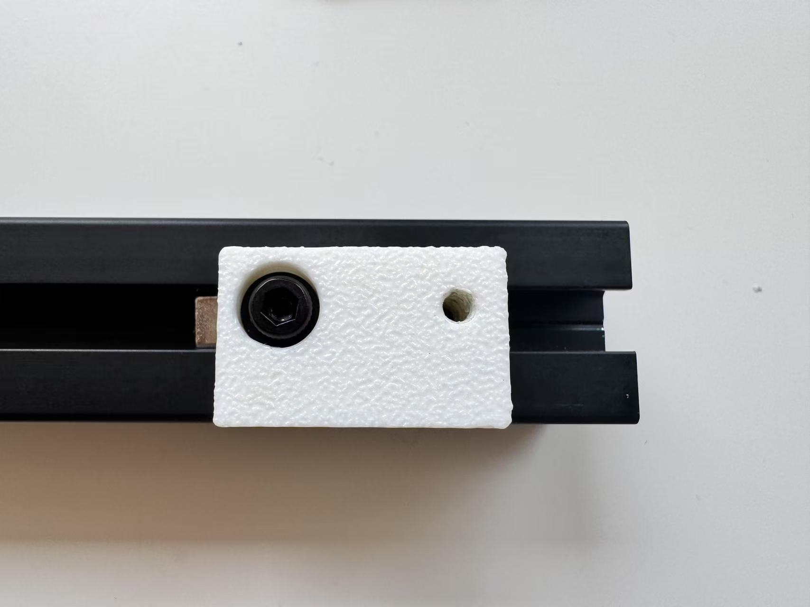
        2. Put tensioner-b inside tensioner-a, align the extrusion on the side. Put a M3x16 SHCS with a M3 washer into the aligned hole in tensioner-b and slot in tensioner-a. 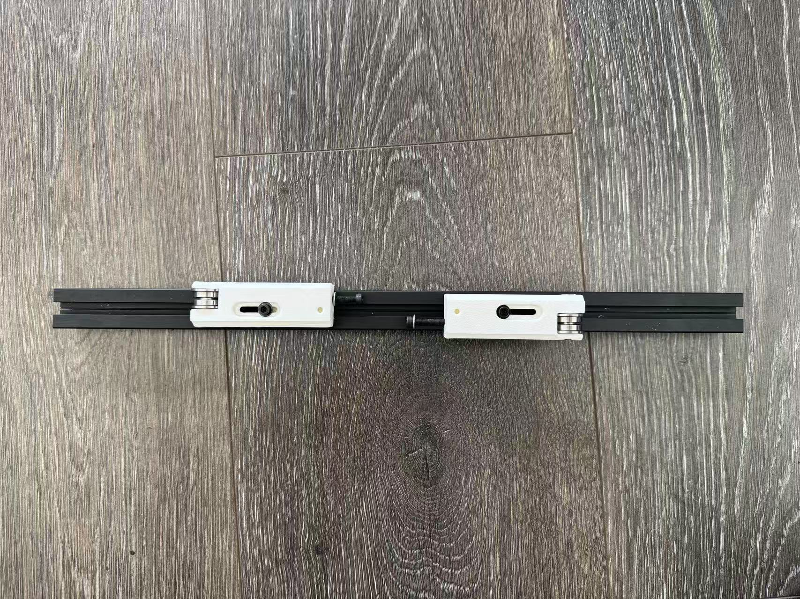
        3. put M3 T-nut on both of these. The aluminum extrusion should slide onto this part later. 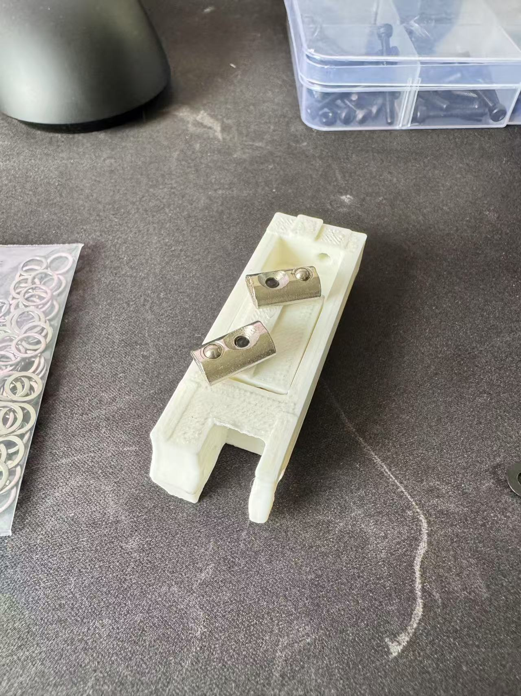
    2. 