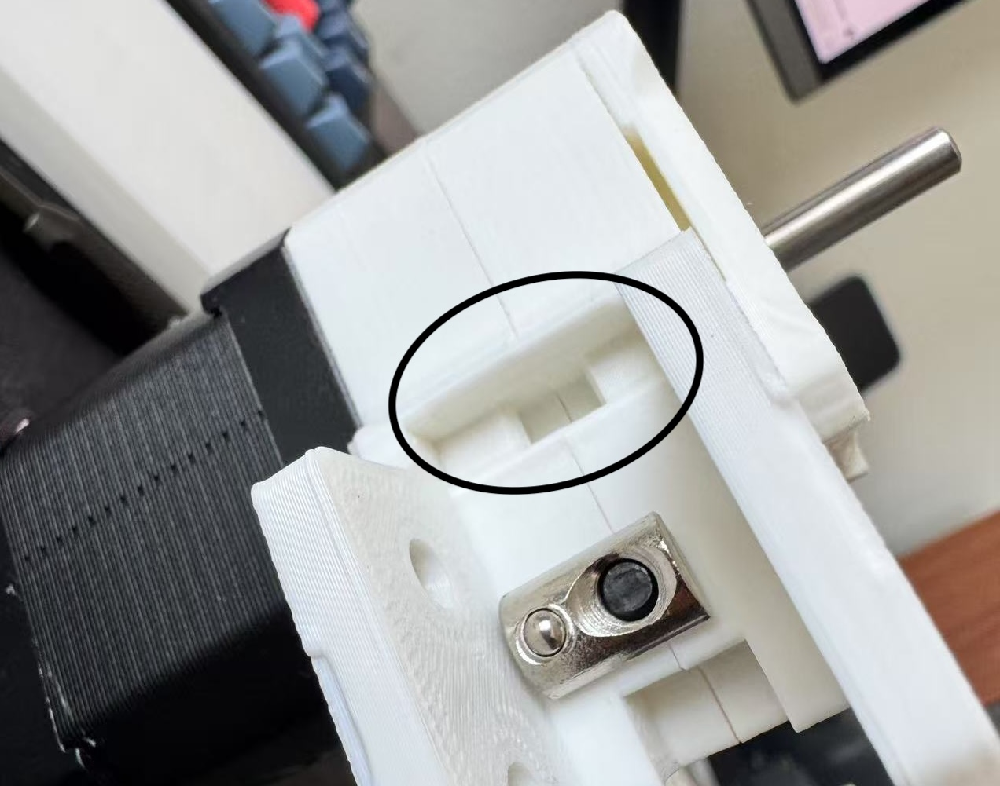
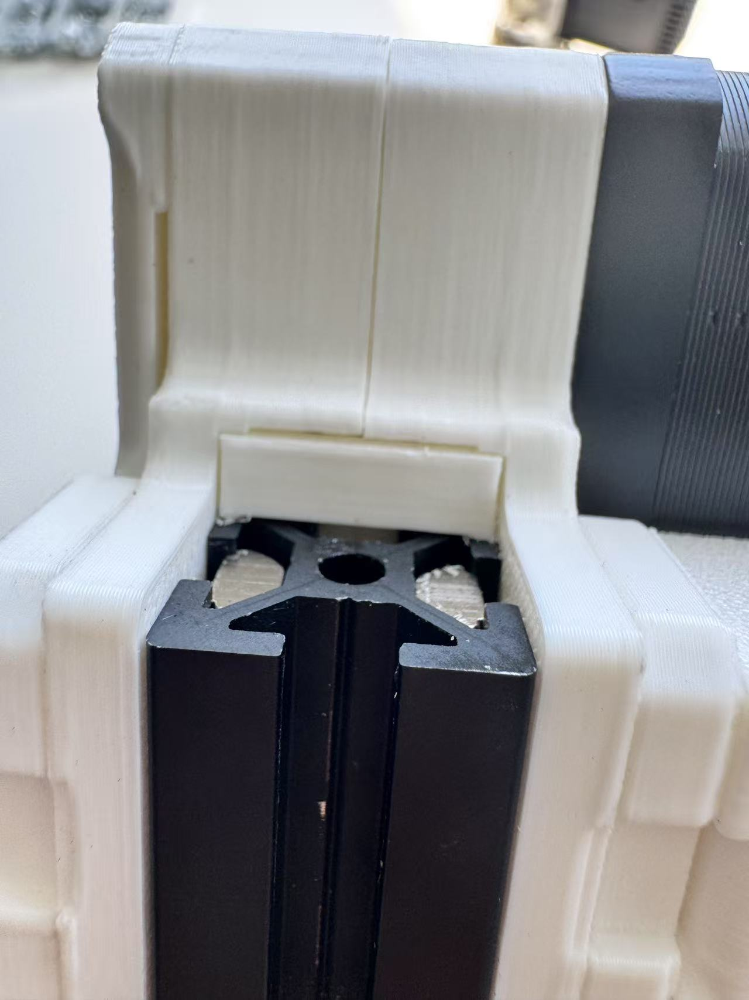
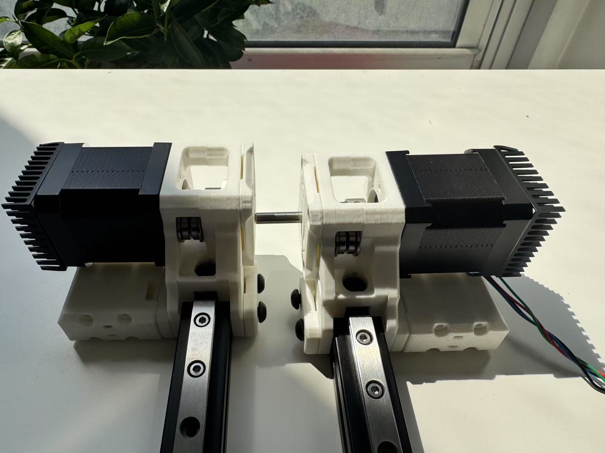
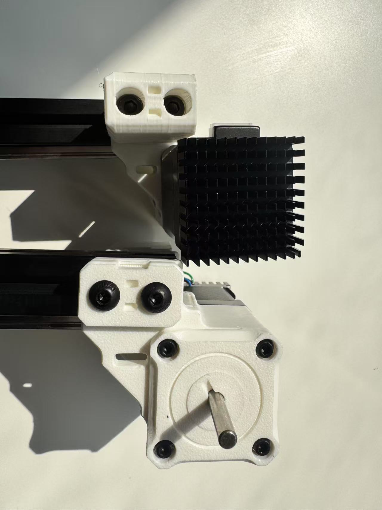
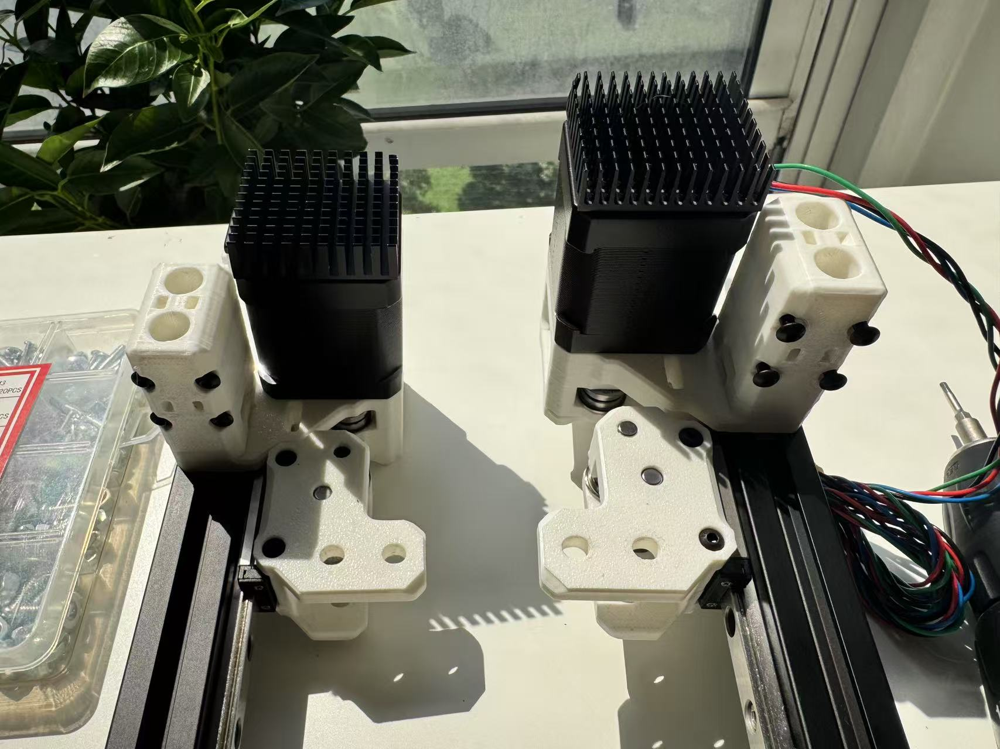
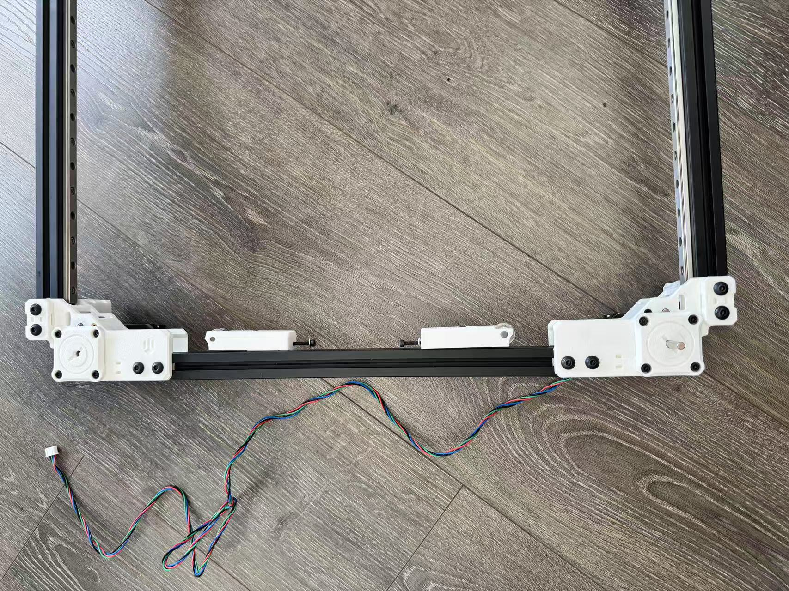
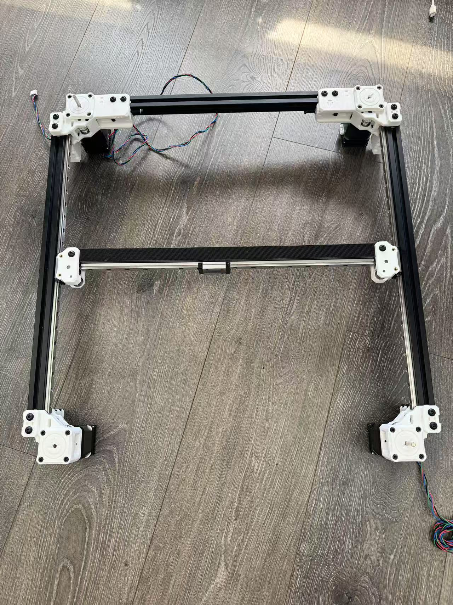

# [Monolith Gantry](https://github.com/CloakedWayne/Monolith_Gantry_V2-VT)

This might be one of the coolest mod I have seen. I have always wanted to do an AWD mod. Who needs a I4 when you can have a V8? However, early AWD mods for Voron 2.4 block off part of a build plate. This makes defining printable area tricky, and I don't trust myself with remembering where i can and can't use. I'm sure there are ways around it from the original creaters and the community, but these issues, together with the lack of a better understanding stopped me before I get to learn more. 

Then there's the Monolith. It's configurable, does not block the print bed, and a vibrant community. The BOM configurator is easy to use (you need to run it in google sheets. Customization is borked if you download it), but there is no installation manual. One can always use the included .step file to have a finished view, and make out steps to do, but this can be compiled better. I will document each step in my build (**printed everything, flying gantry, AWD, 6mm belts, 2 short shafted motors, no sensorless homing, allow front&rear protrusion**) as much as i can [for those who come after](https://www.youtube.com/watch?v=p00EF6_b5pI&list=RDp00EF6_b5pI&start_radio=1). 

## Protrusions
If you allow pertrusion at front, the motor mount and motors get pushed out by 6mms. Similarly, allowing pertrusion at the back pushes the entire assembly at the back (two motor mounts and motors, and x-axis beam) out by 6mm. 

Cleverly, this is done via 4 spacer that attaches to the Z-axis linear rails and pushes the z-joint (and thus each corner of the gantry) together. If you print our "Printed_Hybrid_V2_Z_joint_spacer_NP" and wonder what is the thing in the middle (in itself, it's the "V2_spacer_FT"), well, it is what let you convert into a protruded build. Remove this spacer and put V2_spacer_FT in your rear motor mount as the new stopper for your extrusion, and you get some extra space. 

### What about my panels?
The original mounting method of your panels wont work with protrusions unless they are sitting at least 6mm away from the extrusions. This is exactly what [Monolith Panels](https://github.com/CloakedWayne/Monolith_Panels) do.  They push out the panels by 6mm on each side, uses a clip that grabs onto your extrusion for simplified mounting and removal, and adds some "flare". 

## Plan:
I like to change one thing at a time to better evaluate and trouble shoot my projects, but there's a lot in changing a gantry. We need to consider compatibility in toolhead and z-homing methods, so I looked into this. As it turns out, the belt spacing on a Monolith gantry is identical to that in a standard voron gantry, aside from the fact that the belts are moved outward by ~0.8mm. 

This means that whatever z-homing method/carrige you used with a standard voron build most likely works fine here. The other concern is toolhead. It needs to physically fit in the new constraints set by the front motors, and the constraints are tight to say the least (red rectangle is gained via allowing protrusion). 

Luckily, there are three redeeming qualities. 
1. The space is tight, but large enough. The only necesseties to put in the constrainted space are hotend, hotend fans, and extruder. The extruder can be positioned close enough to the rail to dodge the Nema 17 motors, and the hotend takes even less space. Thus, a toolhead that wastes no space is totally possible.
2. Unless you are working with 4 short shafted motors, all motors will be on top of the gantry. This means you can put as much things as possible under the X-axis. Certain toolhead designs (like the [Gustav Railway Toolhead](https://github.com/RCI-Nicket/Gustav-Railway-Toolhead)) leverages this and puts the part cooling fan under. 
3. I found about 10mm of Y-overtravel in my machine. This means you can fit a CPAP chute down behind the X-axis. 
Overall, a monolith toolhead that preserves all build volume is indeed possible, and there are ongoing progresses to tackle them.

I also need to look into VZbot's toolheads, and how they handle their z-offest and bed mesh generation.

## Comparisons to other AWD projects
The other two AWD projects I looked into are [Mammoth](https://github.com/mammoth-3D/Mammoth-FDM-MODs) and the OG AWD setup by [aTinyShellScript](https://github.com/aTinyShellScript/v2.4_AWD). The mammoth has an interesting design
 that seem to draw more insporation from [VZbot](https://github.com/VzBoT3D/VzBoT-Vz330). It looks extra spacious, and seems to not have any physical constaint from the front motors at all in the same frame of a voron 2.4. This drew my attention: if the z axis beams are at the same position and the Nema 17 motors are a fixed size, there is no reason why it wont block off build volumes for Mammoth while it does for Voron, assuming the same build volume. As it turns out, there's no magic, but subtle differences. 

| Part | mammoth | Voron (and monolith) |
| -------- | ------- |
| X rail | 380mm | 400mm |
| X beam | 414mm | 430mm |
| slider | MGN9H | MGN12H |
| slider width | 39.9mm | 45.3mm |
| Max Effective X travel | 340.1 | 354.7 |

Tinkering with the CAD, I found that the max travel of a mammoth is around 336mm on the X-axis. 

What do you know, the VZbot has a 330mm build. I guess this makes sense. 

Keeping in mind that the nema 17 motors on a monolith blocks off 8.5mm on each side. If we cut those parts out, we get 333mm of travel. Close enough. 

The second contender is [aTinyShellScript's AWD setup](https://github.com/aTinyShellScript/v2.4_AWD) whose CAD files do not include a X-axis for me to tinker with. Luckily, there are other ways we can look into this. First of all, there is no reason to assume any difference on the back side. They all adapt from a stoick voron build with the 10mm overtravel without taking much extra space. On the front side, the Nema 17 motors are further away from the front of the Y-beam, blocking more space in the X and Y axis.

Given that preserving build volume is more important to me than optimization for speed, it is clear that monolith is the way to go.

## Other things you need
You might want to print the [Voron pulley jig](https://github.com/VoronDesign/Voron-2/blob/Voron2.4/STLs/Tools/pulley_jig.stl) and the [hub puller](https://www.printables.com/model/1157086-voronmonolith-pulley-dehubbing-tool). You want to print the hub puller stronger, as dehubbing a pulley requires significant force. You will also need a quarter. 

## My Installation Manual
I will assume that you are familiar with the build process of a Voron 2.4. If not, you can reference the [Voron manual](https://github.com/VoronDesign/Voron-2/raw/Voron2.4/Manual/Assembly_Manual_2.4r2.pdf).

The procedures detailed in the main paragraph involves removing the linear rail slider from the rail, then mounting it back on in a later time. If you rather not do this, in your disassembly, make sure to prevent your slider from sliding off the rail in some way (like loosening the M3x8 SHCS screw mounting the rail), and in step 5, instead of mounting the slider to the XY-joint, mount the XY-joint onto the rail directly.

0. Aside from everything in the BOM, if you come from a standard 2 motor Core-XY build, you need 2 extra motors and 2 stepper drivers. 
1. I printed all my parts with ABS under standard [voron printed parts settings](https://docs.vorondesign.com/sourcing.html).
2. Install Heat Set Inserts 
    - 8x M3xD5x4 threaded inserts
    - 1x Printed_6mm_AWD_XY_joint_right_b, 1x Printed_6mm_AWD_XY_joint_left_b, 2x Printed_6mm_tensioner_b, 2x Printed_V2_6mm_rear_motor_mount_a

    1. The BOM calls for 8 M3xD5x4 threaded inserts. There are 2 in each XY_joint_b, 1 in each tensioner_b, and 1 in each rear_motor_mount_a.

3. Preparation 
    - 12x F695 bearing
    - 2x Printed_long_shaft_double_shear_housing, 2x Printed_long_shaft_double_shear_twist_lock, 2x Printed_short_shaft_double_shear_housing, 2x Printed_short_shaft_double_shear_twist_lock

    1. Make 4 de-hubbed pulley 
        1. The part of the pulley with screw-holes are called the "hub", and the thin side-wall is called a flange. 
        2. To dehub a pulley, remove the hub, then remove the flange from another pulley.  This step is scary and requires some force. If the plastic holding the nut gave out, you can press on the screw directly with a vise.  
        3. Put the removed flange on to the de-hubbed core so both side has a thin flange.
    2. Install flanged bearings into shear housing:
        1. You have printed four shear housing and four twist locks. Depending on how many short shafted motors you use, they can be of different shapes. Short shafted motors use taller housing and twist locks, and long shafted ones use shorter ones.  
        2. Put one F695 bearing into each shear housing, with the flange facing away from the extruded bit. This is not easy, but you can use a de-hubbed pulley as a spacer and a vise to push it in.  
        3. Lock in the twist lock with a quarter. The bearing should sit flush to the protruded face of the housing.  
        4. Furthermore, there are bearing holes in each pieces of XY-joint and back side motor mount. They look like the following.  
        5. Put a F695 bearing in there, the flange should always be put towards the inside of the final part.  

4. Front side 
    - 2x D5x30 shaft, 4x F695 bearing, 2x pulley, 4x 0.5mm M5 shim, 2x 1mm M5 shim, 8x M3x35 SHCS, 8x M3 washer, 1x Nema 17, 1x Nema 17 Long Shaft
    - 2x Printed_V2_6mm_front_motor_mount_a, 2x Printed_V2_6mm_front_motor_mount_b

    1. Insert two D5x30 shaft in the following fashion. They are tight. I used a vise to push it in. The pin is supposed to fix to the body and does not rotate (dead shaft). 
    2. Make 2 bearing kababs with the following layers: 0.5mm M5 shim, F695 bearing, 1mm M5 shim, F695 bearing, 0.5mm M5 shim. The flange on the F695 bearing should be near the 0.5mm shim.  
    3. Install pulleys onto the motor shaft. 
        1. If you usde 2 short shaft motor and 2 long shaft motor, the short shaft motor should have pulley hub away from the motor body, while the long shaft motor should have pulley hub close to pulley body.
        2. Once you mirror the parts, one of them will have the bearing kabab further from the motor. That should be the one to mount the long shaft motor on.   
        3. The spacing between the motor and the pulley and the orientation of the pulley are identical to that of a Voron 2.4 gantry. You can use the [Voron pulley jig](https://github.com/VoronDesign/Voron-2/blob/Voron2.4/STLs/Tools/pulley_jig.stl) to help with the spacing and verify with the CAD for the orientation of the pulley. The pulley's teeth should be on the same height as the bearing kabab you just made. I recommend using locktite for the pulley screws, as per the [Voron manual](https://github.com/VoronDesign/Voron-2/raw/Voron2.4/Manual/Assembly_Manual_2.4r2.pdf).
    4. Install the motor on one side of the front motor mount with 4x M3x35 SHCS with washer (again, making sure that the pulley aligns with the bearing kabab), and install a pairing shear housing on the other side. The bearing in the shear housing should support the other side of the motor shaft, and the shear housing should sit flush to the front motor mount.   

5. XY-joint 
    - 4x D5x30 shaft, 4x F695 bearing, 2x dehubbed pulley, 6x 0.5mm M5 shim, 2x 1mm M5 shim, 4x M4x2.5 set screw, 8x M3x6 BHCS, 4x M3x30 BHCS
    - 2x Printed_spacer, 1x Printed_6mm_AWD_XY_joint_left_a, 1x Printed_6mm_AWD_XY_joint_right_a, 1x Printed_6mm_AWD_XY_joint_right_b, 1x Printed_6mm_AWD_XY_joint_left_b

    1. Each of the four piece of the XY-joint has a crater in the center. Insert a F695 bearing with flange facing inward (the "outside" is the side touching your plate when printed). 
    2. One of the two pieces for each XY-joint has a thicker lip. It is easier (for me) to work on these sides first (right pieces of both assemblies).   
    3. Put a D5x30 pin in the hole on the lip. Make the same kabab as in the front side with 0.5mm M5 shim, F695 bearing, 1mm M5 shim, F695 bearing, 0.5mm M5 shim. 
    4. Put the two pieces of each XY-joint together. They are helded together by the D5x30 pin for now.
    5. Install each XY-joint onto the linear rail with 4 M3x6 BHCS.   
    6. Insert a shaft into the center bearing. Push the shaft half in from the outside. From the side with the lips, add to the shaft a 0.5mm M5 shim, dehubbed pulley (hub facing away from shim), and a printed spacer (lip touching hub of pulley). Adjust the position of the D5x30 pin as needed, and lock the pulley with M4x2.5 screws. Use locktite.   
    7. Install 2x M3x30 BHCS to lock the two pieces together   

6. Tensioners 
    - 2x D5x20 shaft, 4x F695 bearing, 2x 1mm M5 shim, 2x M3x45 SHCS, 6x M3 washer, 2x M3x16 SHCS, 2x M3x10 SHCS, 4x M3 T-nut
    - 2x Printed_6mm_tensioner_a, 2x Printed_6mm_tensioner_b

    1. Grab the shortest aluminum extrusion in the gantry. It is for the backside. Put 2x M3 T-nuts on each end of a side. 
    2. Put a M3x10 SHCS with a M3 washer into the larger hole of tensioner-b, screw into the M3 T-nut closer to the center of the beam. 
    3. Push a D5x20 shaft into tensioner-a . One of the sides has a larger hole. The pin should be inserted from there. Do not put the pin all the way in yet. Be careful, the walls around the shaft is thin.
    4. Put a F695 bearing, 1mm M5 shim, and F695 bearing on the shaft between the two pedals of tensioner-a. I used a tweezer to align the three pieces with the hole. The flange on the F695 bearing should be away from the shim. 
    5. Put tensioner-a on tensioner-b, Put a M3x16 SHCS with a M3 washer into the aligned hole in tensioner-b and slot in tensioner-a. Screw into the other M3 T-nut. 
    6. Put a M3x45 SHCS screw with washer in the hole on the side. Screw in all three screws loosely so that the M3 T-nut slides with the assembly alone the rail. 
    7. The other side should be FLIPPED, not mirrored. 

7. Back side 
    - 2x D5x30 shaft, 2x pulley, 2x dehubbed pulley, 6x M3x35 SHCS, 4x M3x6 BHCS, 2x M3 hex nut, 2x 0.5mm M5 shim, 2x M3x25 SHCS, 2x M5x10 BHCS, 2x M5 washer, 8x M3 washer, 4x M4x2.5 set screw, 1x Nema 17, 1x Nema 17 Long Shaft
    - 2xPrinted_spacer, 2x Printed_V2_6mm_rear_motor_mount_a, 2x Printed_V2_6mm_rear_motor_mount_b

    1. Install pulleys onto the motor shaft. This is identical to what you did for the front mount, and the teeth should lign up with the tensioners' bearing kabab. 
    2. Grab the two pieces without the Monolith logo. We will start building from this side. 
    3. Insert a D5x30 shaft into the F695 bearing and make a bearing kabab with a 0.5mm M5 shim, a dehubbed pulley (hub facing away from shim), and a printed spacer (lip touching the pulley). Again, the dehubbed pulley should be secured onto the shaft with the M4x2.5 set screw using locktite.
    4. Loosely connect a M5x10 BHCS screw with a washer to a M5 T-nut, and drop it into the slot.   
    5. Out of the four printed pieces for the back, grab one piece with the monolith logo, and one piece without. Put a M3 hex nut  in this position of each piece. 
    6. Put the two pieces of each back side together. Double check that all shims and washers are still there. Make sure you DO NOT put the two pieces with M3 hex nuts into one. In other words, the motor mount on each side should have one and exactly one M3 hex nut. Locate the screw hole with a M3 threaded insert. Screw in a M3x25 SHCS from the other side to lock the two pieces together.
    7. Install the motors. Your motor should be on the side WITHOUT the M3 hex nut. Drop a M3x6 BHCS in to the same hexagonal hole where you installed the M3 hex nut, and screw it into the motor from the top. 
    8. Finish installing the motors by putting on a shear housing corresponding to your shaft length, and screw in 3x M3x35 SHCS (with washer) on the corners WITHOUT the M3x6 BHCS screw (and the M3 hex nut).
    9. Put a M3x6 BHCS in the last hole on the shear housing (again, with washer), it has the M3 hex nut you put in earlier on the other side.   

8. Mid-assembly check-up

   1. So far, we have created all the major components. The next steps will involve putting them and the aluminum extrusions together. 

   2. This is a good time to stop, sit back, grab a cup of coffee, and double check each washer, shim, and screws.

   3. In terms of hardware, we have used:

       | Used Up | Part                         | BOM Qty | Used | Remaining |
       |--------|------------------------------|---------|------|-----------|
       | ✅     | M3 hex nut                   | 2       | 2    | 0         |
       | ✅     | M3x6 BHCS                    | 12      | 12   | 0         |
       | ✅     | M3x10 SHCS                   | 2       | 2    | 0         |
       | ✅     | M3x16 SHCS                   | 2       | 2    | 0         |
       | ✅     | M3x25 SHCS                   | 2       | 2    | 0         |
       | ✅     | M3x35 SHCS                   | 14      | 14   | 0         |
       | ✅     | M3x45 SHCS                   | 2       | 2    | 0         |
       | ✅     | M3xD5x4 threaded insert      | 8       | 8    | 0         |
       | ✅     | M4x2.5 set screw             | 8       | 8    | 0         |
       | ✅     | D5x20 smooth pin             | 2       | 2    | 0         |
       | ✅     | D5x30 smooth pin             | 8       | 8    | 0         |
       | ✅     | F695 flanged bearing         | 24      | 24   | 0         |
       | ✅     | GT2 20T 6mm pulley           | 4       | 4    | 0         |
       | ✅     | GT2 20T 6mm pulley de-hubbed | 4       | 4    | 0         |
       | ✅     | Shim 0.5mm                   | 12      | 12   | 0         |
       | ✅     | Shim 1mm                     | 6       | 6    | 0         |
       | ✅     | NEMA17                       | 2       | 2    | 0         |
       | ✅     | NEMA17 with 45mm long shaft  | 2       | 2    | 0         |
       | ❌     | M3 2020 drop-in T-nut        | 8       | 4    | 4         |
       | ❌     | M3 washer                    | 24      | 22   | 2         |
       | ❌     | M3x12 SHCS                   | 2       | 0    | 2         |
       | ❌     | M3x30 BHCS                   | 20      | 4    | 16        |
       | ❌     | M5 2020 drop-in T-nut        | 34      | 0    | 34        |
       | ❌     | M5 washer                    | 4       | 2    | 2         |
       | ❌     | M5x10 BHCS                   | 18      | 2    | 16        |
       | ❌     | M5x16 BHCS                   | 8       | 0    | 8         |
       | ❌     | M5x40 SHCS                   | 8       | 0    | 8         |

   4. We have used all printed parts aside from:

       | Part                    | Qty |
       |-------------------------|-----|
       | Printed_V2_Z_belt_clamp | 8   |
       | Printed_V2_Z_joint_a    | 2   |
       | Printed_V2_Z_joint_b    | 2   |
       | Printed_Hybrid_V2_Z_joint_spacer_NP/V2_spacer_FT | 4 |
       | KW10 microswitch        | 2   |
       | M2x10 screw             | 4   |
       | Y_endstop_housing       | 1   |
       | X_endstop_housing       | 1   |

    5. We have also not used the 2MGT belt.

    6. If you allow protrusion, now is the time to grab your V2_spacer_FT or break it off of Printed_Hybrid_V2_Z_joint_spacer_NP, and install it in each of the four motor mounts. It will snap into a slot like this   

    - All looks good? Great! Let's keep going. 

9. Front-Y
    - 4x M5x40 SHCS, 8x M3x30 BHCS, 4x M5x16 BHCS, 2x M5x10 BHCS, 2x M5 washer, 10x M5 T-nut

    1. Drop 1x M5 T-nut on the side of the Y-extrusion with the linear rail, and 2x M5 T-nut on the two sides adjacent to the side with linear rail. Their location can be adjusted later.
    2. Push the front motor mounts onto the aluminum extrusion. The extrusion should sit as deep as possible, pushing into either the motor mount or the spacer you just put in.   
    3. Screw a M5x10 BHCS with washer into the M5 T-nut on the rail side.   
    4. Align the two M5 T-nuts on each side with the two holes on the front motor mount. You can push the nuts out of the rail from each ends if necessary.
    5. For the far side from the motor, put a Z-belt clamp, then lock in place with two M5x16 BHCS.The groove of the Z-belt clamp should face the motor mount, and the slot should face away from the motor.
    6. For the two holes near the motor, put a Z-belt clamp (again, groove facing motor mount, slot should face away from the motor), and a Z-joint. Screw in two M5x40 SHCS from above the Z-joint.   
    7. Put a M3x30 BHCS into each of the four holes on the z-joint. They are to secure the gantry onto the Z-rails. They are here for completion for now.

10. Y-sliders
    1. Now that your linear rails wont slide off the front side of Y-axis. you can mount the XY-joints onto the Y-axis. Be very gentle and careful, as these bearing balls can fly out under little pressure. See picture for orientation   

11. Back-Y
    - 4x M5x40 SHCS, 8x M3x30 BHCS, 4x M5x16 BHCS, 2x M5 washer, 10x M5 T-nut

    1. Exact same process as for the front, except for this time, the one screw on the rail side is already locked to a T-nut from when we put the back motor mount together. This does not matter, you can unscrew it and install the mount to the extrusions the same way you did for front-Y.

12. Back-X
    - 8x M5x10 BHCS, 8x M5 T-nut

    1. Put 2x M5 T-nut on each end of each face adjacent to the back extrusion with the tensioner. Again, bulky end of the T-nut should face inside of the extrusion.
    2. Screw in a M5x10 BHCS into each hole. The tensioner should be on the inside of the finished gantry.  
    3. Make sure that the bearing kabab on the tensioner is on the same height as the MOTOR PULLEY. If not, flip the back beam.   

13. X-axis
    - 6x M5x10 BHCS, 6x M5 T-nut (I use Mellow's CF-tube, and M5 Flanged nuts)

    1. Install your T-nut/Flanged nut into the rail. If you also use Mellow's CF-tube, you can use this [nut holder](https://www.printables.com/model/1135261-voron-24-350-x-axis-nut-holder/files). Monolith uses the same nut pattern as Voron, so all the fancy beams are cross-compatible.  

14. Y-endstop
    - 2x M3 T-nut, 2x M3x12 SHCS, 1x KW10 microswitch, 1x M2x10 screw

    1. Install the Y-switch onto Y_endstop_housing.
    2. Set the two M3 T-nuts into the back-X extrusion, and install the Y_endstop_housing, screw in 2 M3x12 SHCS screws. The location of this endstop does not matter, as it is triggered by the X-axis.

15. X-endstop

    1. My old configuration uses a toolheadboard and my x-endstop is toolhead mounted. Install this according to your toolhead. You may also need a different XY-joint piece. 

15. Belt Path

We are done! From here, you should follow the Voron manual to mount the gantry onto the Z-rails and belts, [square the gantry](https://ellis3dp.com/Print-Tuning-Guide/articles/voron_v2_gantry_squaring.html) then proceed onto electrical/configuration settings. GLHF!

## Looking back:
In terms of hardware, we have used:

| Used Up | Part                         | BOM Qty | Used | Remaining |
|--------|------------------------------|---------|------|-----------|
| ✅     | M3 hex nut                   | 2       | 2    | 0         |
| ✅     | M3x6 BHCS                    | 12      | 12   | 0         |
| ✅     | M3x10 SHCS                   | 2       | 2    | 0         |
| ✅     | M3x16 SHCS                   | 2       | 2    | 0         |
| ✅     | M3x25 SHCS                   | 2       | 2    | 0         |
| ✅     | M3x35 SHCS                   | 14      | 14   | 0         |
| ✅     | M3x45 SHCS                   | 2       | 2    | 0         |
| ✅     | M3xD5x4 threaded insert      | 8       | 8    | 0         |
| ✅     | M4x2.5 set screw             | 8       | 8    | 0         |
| ✅     | D5x20 smooth pin             | 2       | 2    | 0         |
| ✅     | D5x30 smooth pin             | 8       | 8    | 0         |
| ✅     | F695 flanged bearing         | 24      | 24   | 0         |
| ✅     | GT2 20T 6mm pulley           | 4       | 4    | 0         |
| ✅     | GT2 20T 6mm pulley de-hubbed | 4       | 4    | 0         |
| ✅     | Shim 0.5mm                   | 12      | 12   | 0         |
| ✅     | Shim 1mm                     | 6       | 6    | 0         |
| ✅     | NEMA17                       | 2       | 2    | 0         |
| ✅     | NEMA17 with 45mm long shaft  | 2       | 2    | 0         |
| ❌     | M3 2020 drop-in T-nut        | 8       | 4    | 4         |
| ❌     | M3 washer                    | 24      | 22   | 2         |
| ❌     | M3x12 SHCS                   | 2       | 0    | 2         |
| ✅     | M3x30 BHCS                   | 20      | 20    | 0        |
| ✅     | M5 2020 drop-in T-nut        | 34      | 34    | 0        |
| ✅     | M5 washer                    | 4       | 4    | 0         |
| ✅     | M5x10 BHCS                   | 18      | 18    | 0        |
| ✅     | M5x16 BHCS                   | 8       | 8    | 0         |
| ✅     | M5x40 SHCS                   | 8       | 8    | 0         |

There are some descrepencies in BOM V1.0.10. The 4 extra M3 T-nut are for mounting X/Y endstops (2 each), and the 2 extra M3x12 SHCS are for the Y endstops. The X-endstop uses 2x M3x30 SCHS that is not included in the BOM to pair with the other two M3 T-nuts. The BOM also calls for 2 extra M3 washers due to a mistake in CAD. This issue has been [mentioned to the team](https://github.com/Monolith3D/Monolith_Gantry/issues/15).

Furthermore, I need a new way to get Z-offsets and X-endstops.