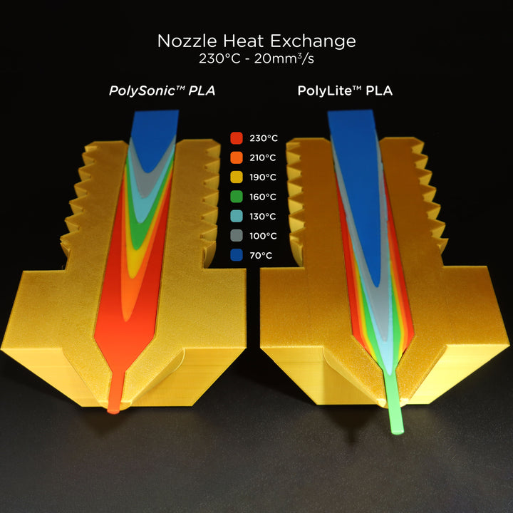

# Overview

I don't imagine anyone truly **needs** to print a Benchy in under three minutes. However, having the ability to do so is cool, particularly when you can effortlessly switch between different slicer profiles. In this section, my goal is to maximize the printer's speed without introducing mechanical limitations that compromise print quality. My standard is that the printer must remain accurate when using moderate, practical slicer settings.

## Toolhead
> “Aerodynamics are for people who can’t build engines.” — Enzo Ferrari 
Jokes aside, I found that most of the time the speed of a print is not limited by the motion system. At the end of the day, regardless of how fast you can fling that toolhead, plastic needs to be melt at a matching rate. There are few factors relating to the ability a toolhead has to melt plastics. 

### Extruder
Assuming that your hotend is capable, you need to push plastic through it as fast as possible. Your extruder need to grab onto the filament well and shove it into the hotend hard. When that fails, you get underextrusion. It is hard to isolate the job of an extruder from that of the hotend: as much as insufficient torque from the extruder motor causes skipping, so can a slow-heating hotend causing too much back pressure. Furthermore, even though a stong extruder can push out more filament through a less powerful hot end, you need to make sure that the plastic has melted properly. Thus, as long as your extruder is "good enough" and is outputting decent torque at the requested RPM, you should be good to go. This is finicky, but luckily seldomly the bottleneck to printing fast.

### [Hotend](https://e3d-online.com/blogs/news/anatomy-of-a-hotend)
Hotend is arguably the most important piece to printing fast. It is the element that melts the plastic, which is commonly the bottleneck to how fast a print can be done. There are many things that can go wrong. An inadaquate hotend causes excessive back pressure when filament enter the heating chamber faster than they leave, causing extruder to skip. With inadequate cooling, the cold side can get too hot and melt the plastic outside of the heating zone, stuck up the extruder, or overfill outside the toolhead. There are many elements at play, including the length of the heating block, design of the nozzle, wattage, heat break quality, etc. For example, the [Goliath](https://github.com/VzBoT3D/Goliath) hotend features a long heating block and a high wattage heater, and is able to heat up filaments faster than many other hotends. Similarly, the [supervolcano](https://www.filastruder.com/products/e3d-supervolcano?variant=16161872445511) also has a (staggeringly) long heating block and a (equally staggeringly) long nozzle to heat up filaments faster. On the contrary, a [rapido](https://www.phaetus.com/en-us/products/rapido-hotend) has a much shorter heater block in comparison, thus (generally) melts plastic slower. It is hard to compare hotends apples to apples. Some companies(like Phaetus, slice engineering, and triangle labs) put out generic testing data for comparison, but they are not reliably available.

### Cooling
Once molten plastic exits the nozzle, they need to be cooled fast, before they can deform. A part cooling fan is for this exact reason. You don't strictly **need** part cooling. At the end of the day, the speed benchy race never specified how beautiful your print need to be. That said, unless your .STL file entails a big messy blob, you want to have adaquate cooling. Luckily, there is no mechanical disadvantage to more cooling (aside from weight). As long as they fit, the more air the better! Extra credit if you can move cooling away from your toolhead with a cpap kit so the weight disadvantage is nolonger a concern.

## Motion system
> “There’s no replacement for displacement.” — Carroll Shelby
This section will be physics dominated. Sadly I have not learned anything about physics since high school. I will understand/compile/explain them as much as i can, but i cannot promise much about their accuracy. 

### Friction
Any power not spent on moving the toolhead is power wasted. Remember to lube your linear rails and check for binds in your belt path!

### Motors
Assuming that the bottleneck to your print speed is in the motion system, bigger motors is the most straight forward way to solve it. Faster, stonger motors can overcome most difficulties in the motion system, albeit potential inefficiency. With a torque curve that make me go sheeeesh, new developments like the [Kraken Motors](https://west3d.com/products/kraken-motors-from-devil-design-ldo-42sth60-3004ah-s37-and-s55-extreme-stepper-motor) offer a big leap from the previous fan favorites (the likes of LDO 42STH48-2504AC) in both torque and price. Since we are looking for speed, there are a few things we should consider
- **Read the datasheet**
- We want large step angle. Stepper motor's torque output is measured by PPS, essentially step per second. Given their general trend of torque falloff after a certain PPS, the larger step size (less stepo per revolution) the better torque at the same speed output to the belt.
- Use as high of a voltage as possible. High voltage generally results in higher torque for the same rpm. 
- Higher amperage is also helpful, but can you manage the heat?
Besides these aspects, don't forget to double check that the motor matches your spec. What physical dimension can you accomodate? how long of a shaft do you need? D-cut or round shaft?

### Belts
I only realized this recently though my [Monolith AWD project](Monolith.md). Belts might felt strong, but they behave like a (rather rigid) spring. On a long belt path, especially those with many idlers, the belt is more springly, and has a lower resonance frequency and more friction. This springyness introduces lag and limits how fast you can accelerate, and can introduce ringing. Thus, many gantry mods for voron focus on using more efficient and shorter belt paths. Furthermore, AWD builds with 2 motors per belt has a natual advantage, as effective belt length is halved.

### Weight
As a wise man (Newton) once said,
> "F = M*A." — Newton
Here, F is the output from the motor (F = torque/radius), M is the mass of the toolhead (and resistance from belt, linear rail, etc.), and A is the number we want to maximize. We covered how to increase F and decrease M in terms of friction and springyness, but you should also consider decreasing M from the toolhead and X-axis, or anything that moves in the XY-plane. a carbon fiber X-axis replacing the 2020 extrusion shaved almost 20% off of the weight of all that moves in the XY-plane in my voron 2.4, allowing my acceleration to be higher than before. It also reduces belt stretch. From my testing, I am able to increase my max_accel from 15k to 22.5k mm/s^2 with this simple change.

## Filaments
Chemical properties of filaments also plays a role in how fast plastic can be melt. My favorite illustration of this is from [Polymaker](https://us.polymaker.com/products/polysonic-pla). Make sure that the filament you use is up for the job.

## Slicer Settings
Slicer settings is tricky. There are a lot of moving parts, and many of them do different things in different implementations. This will be covered in a separate page in the future.